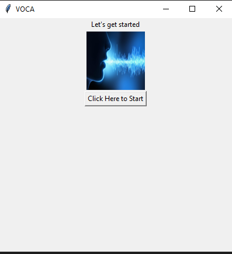
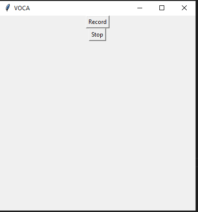
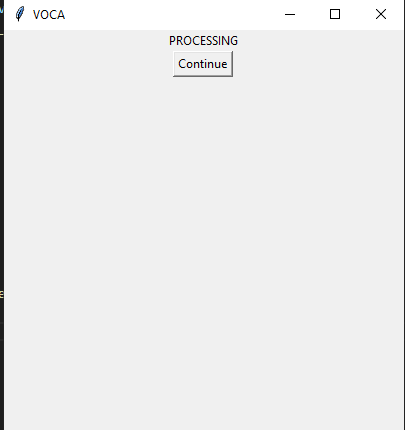
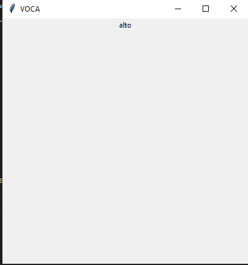

## Table of contents

- [Overview](#overview)
  - [Screenshot](#screenshot)
  - [Video](#video)
- [My process](#my-process)
  - [Built with](#built-with)
- [Installation]
- [Author](#author)

## Overview

### Screenshot

### Video

## My process

### Built with

- UI Build
- PyAudio Build 
- Frequency Hertz geting max and min
- RandomForest Algorithm
- Prediction Vocal

## Installation
https://www.python.org/downloads/
pip install -U scikit-learn
pip install pandas
pip install scipy
pip install pillow
pip install tk
pip install PyAudio
pip install Wave

## Author

- [Daniel Doysabas]
